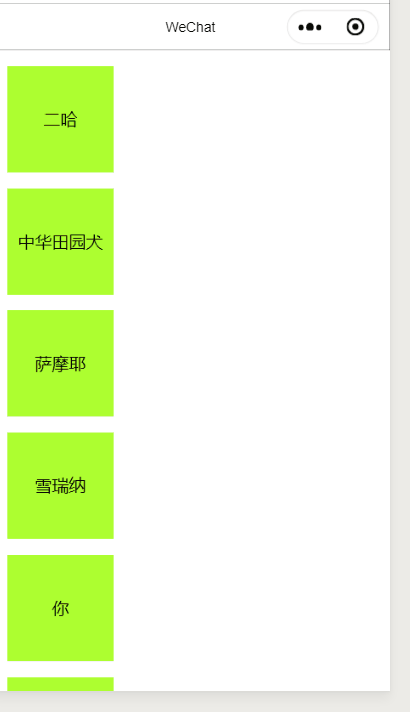

# Mask-Scroll

> [原码地址]()

### 蒙层防穿透问题
  > 蒙层穿透就是，当你用fixed 布局让蒙层显示的时候， 手指滑动屏幕会出现底部内容也滑动的现象. 如图： 

   

   当蒙层出现的时候，你滚动屏幕，底部内容也一起跟着滚动。 这就是蒙层穿透， 也可以叫 '滚动穿透'. 当然出现这种情况， 用户体验当然是不好的了。 所以作为一个有点追求的工程师当然是不允许这种情况的发生了(手动狗头...)
   
   
   ## 解决方案
   ---
   这种要分情况，
   - 当蒙层没有滚动条的时候。
   - 当蒙层出现滚动条的时候

### 1. 当蒙层没有滚动条的时候。

直接监听 catch:touchmove 方法， 然后直接返回就可以了。可以去看 fixed 目录下的文件 

```js
// wxml
  <view 
    class="fixed-mask"
    bind:tap="hideMsak"
    wx:if="{{isShowMask}}"
    catch:touchmove="stopMove">

    <view class="mask-container" >
      <view class="mask__item">
        I am  {{dogName}}
      </view>
    </view>
  </view>

  // css
  .fixed-mask {
  position: fixed;
  left: 0;
  top: 0;
  height: 100vh;
  width: 100vw;
  background: #333;
  opacity: 0.8;
  z-index: 2;
}

.mask-container {
  position: absolute;
  top: 50%;
  left: 50%;
  transform: translate(-50%, -50%);
}

.mask__item {
  margin: 0 auto;
  background-color: #ff0015;
  text-align: center;
  width: 500rpx;
  height: 500rpx;
  line-height: 500rpx;
  margin-bottom: 20rpx;
}
// js

  stopMove () {
    return;
  }
```


